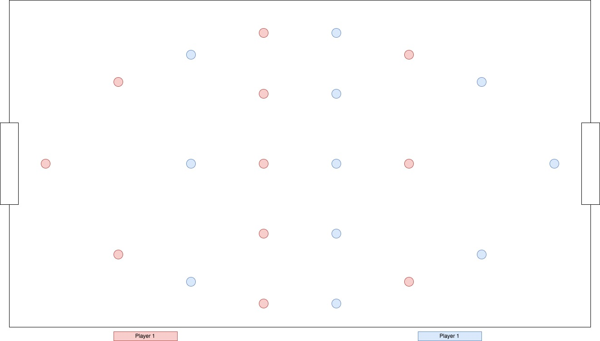

#MagnaBall

MagnaBall is a game concept based on foosball. The traditional spinning players are replaced with magnetic nodes that push or pull the puck. It is written in JavaScript, using the PhysicsJS and EaselJS libraries, and HTML 5.

#Setup
On game start, the puck is launched from the top-center of the board with a semi-random vector.

#Playfield
There are 8 rows of magnets, divided into 2 types: Player 1 and Player 2 magnets.

#AI
The AI responds to the puck being in range of one of its magnets by activating that column. The difficulty setting will change the delay on the AI players reaction.

##Score
The score object tracks each players score. Upon one player reaching 5 points, the game ends with that player as the winner.

#Physics

##Puck
The puck object has a vector composed of an X direction, a Y direction, and a velocity. Each frame of the game, the puck moves corresponding to its vector property. If the puck loses its velocity, a countdown will start. On timeout, the puck is reset to the starting position of launching from the top-center of the board.

##Magnets
The game uses the PhysicsJS library to temporarily give magnets positive or negative gravity. The magnets remain stationary, but the puck reacts to the new gravity on the magnet objects. Magnet columns exist in either a positive or negative state. Activating a column pushes or pulls the puck to or from each magnet in the column according to the column's state. After activating a magnet column, the column will be in "cool off" mode for a short length of time to recharge. The magnet state will switch between positive and negative after the cooldown has ended. Each magnets have a + or - indicator on them to represent their current state. The columns are activated by pressing the "A," "S," "D," or "F" key for player one, and the "J," "K," "L," and ";" key for player two. The magnets are colored blue for player one, and red for player two.

##Walls
The walls represent the borders of the playing field. If the puck hits a horizontal wall, its Y vector inverts. If it hits a vertical wall, its X vector inverts.

##Goals
Goal objects are placed halfway down the vertical walls of the playfield. If the puck hits the goal, the scoring player's score is incremented.

#Project Timeline

##Day 1
Set up the basic board, including goal and magnet placement. Build graphics and base object models. Get familiar with EaselJS.

##Day 2
Set up physics for puck, walls, magnets.

##Day 3
Set up scoring, scorekeeping, title page
